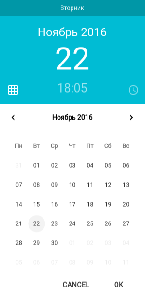
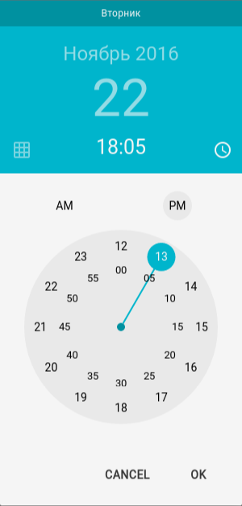

# Material DateTime Picker for React.js

Простой компонент для React'а в стиле Material Design. Без использования jQuery.

Оригинал взят [отсюда](https://github.com/ripjar/material-datetime-picker)




## Установка

~~~
npm install --save react-material-datetime-picker
~~~

## Подключение

Для подключения компонента нужно:

```javascript
import DataTimePicker from 'react-material-datetime-picker';
```

Также, не забудьте подключить файл со стилями

```html
<link rel="stylesheet" href="node_modules/react-material-datetimepicker/build/react-material-datetime-picker.css">
```

## API

По-умолчанию используются внутренние свойства и обработчики. 

### Параметры
`day` (*string*) - день. **По-умолчанию**, текущий день (по времени установленному в ОС)

`hours` (*string*) - часы. **По-умолчанию**, текущий час (по времени, установленному в ОС)

`minutes` (*string*) - минуты. **По-умолчанию**, текущая минута (по времени установленному в ОС)

`month` (*string*) - месяц. **По-умолчанию**, текущий месяц (по времени установленному в ОС)

`show` (*bool*) - показывать комонент или скрыть его. **По-умолчанию**, true

`showCalendar` (*bool*) - показывать календарь. **По-умолчанию**, показываются.

`showClock` (*bool*) - показывать часы. **По-умолчанию**, скрыты

`type` (*bool*) - активная вкладка: календарь/часы. true - активен календарь, false - активены часы. **По-умолчанию**: true

`weekday` (*string*) - день недели. **По-умолчанию**, текущий день недели (по времени установленному в ОС)

`year` (*string*) - год. **По-умолчанию**, текущий год (по времени установленному в ОС)

### Обработчики

При вызове, обработчику передается 3 аргумента: контекст компонента (this) для обращения к его состоянию, 
аргументы для, которые изначально передавались передавались обработчику, сам обработчик.  

`clickOnCancel` - Обработчик нажатия на кнопку Cancel

`clickOnOK` - Обработчик нажатия на кнопку OK

`handleChangeDay` - Обработчик изменения месяца

`handleChangeHours` - Обработчик изменения часов

`handleChangeMinutes` - Обработчик изменения минут

`handleChangeMonth` - Обработчик изменения месяца

`handleChangeType` - Обработчик изменения активной вкладки (календарь/часы)

## Простой пример использования
```javascript
"use strict";

import React, { Component, PropTypes }  from 'react';
import ReactDOM from 'react-dom';

import DataTimePicker from 'react-material-datetime-picker';

class App extends Component {
    constructor(props) {
        super(props);
    }

    render() {
        return (
            <DataTimePicker />
        );
    }
}

ReactDOM.render(<App />, document.getElementById('app'));

```

## Пример использования с передачей своих свойств

Для удобной работы со временем, советую использовать Moment.js - библеотеку для работы со временем.

```javascript
"use strict";

import React, { Component, PropTypes } from 'react';
import ReactDOM from 'react-dom';
import moment from 'moment';
import 'moment/locale/ru';

import DataTimePicker from 'react-material-datetime-picker';

class App extends Component {
    constructor(props) {
        super(props);

        moment.locale('ru');

        /**
         * Состояние, где будут хранится параметры компонента
         */
        this.state = {
            day: moment().format("DD"), // день
            hours: moment().format("HH"), // часы
            minutes: moment().format("mm"), // минуты
            month: moment().format("MMMM"), // месяц
            show: true, // показать/скрыть компонент
            showCalendar: true, // покаывать календарь
            showClock: false, // показывать часы
            type: true, // активная вкладка
            weekday: moment().format("dddd") // день недели
            year: moment().format("YYYY"), // год
        }
    }

    render() {
        const {day, hours, minutes, month, show, showCalendar, showClock, type, weekday,year} = this.state;

        return (
            <DataTimePicker
                day={day}
                hours={hours}
                minutes={minutes}
                month={month}
                show={show}
                showCalendar={showCalendar}
                showClock={showClock}
                type={type}
                weekday={weekday}
                year={year}
            />
        );
    }
}

ReactDOM.render(<App />, document.getElementById('app'));

```
## Пример использования с передачей своих обработчиков

При вызове обработчика, ему передается конекст компонента (this).

```javascript
"use strict";

import React, { Component, PropTypes }  from 'react';
import ReactDOM from 'react-dom';

import DataTimePicker from 'react-material-datetime-picker';

class App extends Component {
    constructor(props) {
        super(props);
    }

    /**
     * Обработчик изменения активной вкладки (календарь/часы)
     * @param context
     * @param arg
     * @param lastHandler
     */
    handleChangeType = (context, arg, lastHandler) => {
        // conext - this компонента DateTimePicker
        // arg - объект с аргументами
        // lastHandler - исходный обработчик
        
        console.log(context.state); // выведется все состояние компонента
        
        // можно изменять внутренние свойства
        context.setState({
           type: true,
        });
        
        console.log(arg); // выведеться {type: false} или {type: true}
    };

    /**
    * Обработчик нажатия на кнопку OK
    */
    clickOnOK = (context, arg, lastHandler) => {
        lastHandler(); // при вызове исходного обработчика - аргументы передавать не нужно
    };

    render() {
        return (
            <DataTimePicker
                handleChangeType={this.handleChangeType}
                handleChangeMonth={this.handleChangeMonth}
                handleChangeDay={this.handleChangeDay}
                handleChangeHours={this.handleChangeHours}
                handleChangeMinutes={this.handleChangeMinutes}
                clickOnCancel={this.clickOnCancel}
                clickOnOK={this.clickOnOK}
            />
        );
    }
}

ReactDOM.render(<App />, document.getElementById('app'));

```